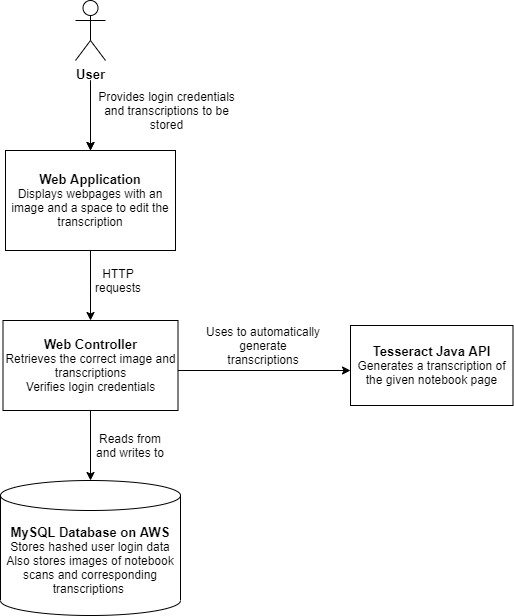
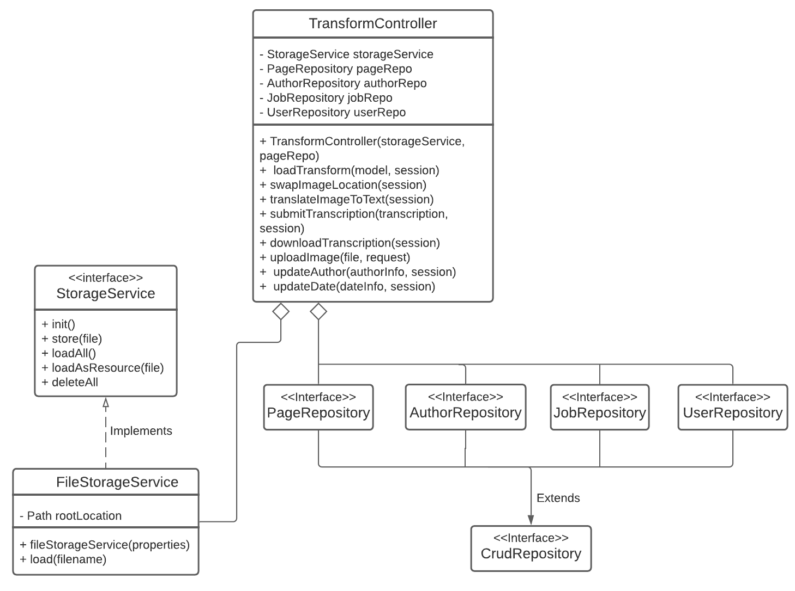
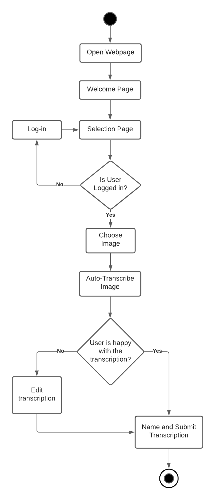

# Portfolio B

## Overview
### Our Client
Our client for this project is Mark Pajak, who is Head of Digital Development for Bristol Museums Galleries and Archives. Mark and his team manage technology online and on-site and his interests involve digitising museum collections. Bristol Museums Galleries and Archives do important work to conserve the artifacts and history of not only Bristol but the world. Along with biological specimens, the museum has texts regarding wildlife observations. Bridging the gap between physical and technological curation is especially relevant today so our client has requested a system that aids in the transcription of handwritten notebooks. It's important that museums don't lose important information stored in an analogue form.

### The Application Domain
The main sample of notebooks we aim to help transcribe are biological recordings of butterflies, which contain important data on species-some of which are now extinct. If this data can be easily digitised, it can be aggregated online for use by scientists/historians. Mark hopes that the data extracted from these notebooks could be added to the National Biodiversity Network Atlas. Bristol Museum has transcribers to work on this project of digitising the information and our system aims to act as a unified tool for them. There is physical access to the notebooks but the museum can photograph them, allowing transcribers to work remotely. Currently, to transcribe notebooks, they simply read through the handwriting and type up a transcription in a text editor.

### The Problem
Transcribing handwritten notes is a task with difficulty that is subject to varying aspects of the handwriting and notetaking. Currently, this takes a long time as a transcriber must learn the handwriting of each individual collector and manually transcribe the text into a digital format. Making this worse, there is not one single system that the transcribers can use for creating, storing, managing and exporting transcriptions. The most useful piece of software available would most likely be a standard text editor coupled with a cloud storage system, but this is less than elegant considering that there isn't support to be able to view an image while transcribing it. If the handwriting is uniform and therefore not challenging to read, there isn't a system to automatically digitise it and our extension will be to attempt to speed up transcription this way.

### Our Vision
We will create a piece of software to speed up the process of transcribing notebooks in Bristol Museum. The system will be incorporated into an open-source web application written mainly in Java and using the Spring Boot framework. In the backend, the website will be hosted on an Amazon Web Services instance. The reason we have opted to implement our application as a web-app is to allow for the museum transcribers to freely access the tool anywhere and to avoid installation troubles. Our main implementation goal is to create a tool that allows the user to select an image of a notebook page on one half of the screen and transcribe the text into an area on the other half. Along with this we will create a backend system that allows for organised storage of materials and transcriptions. Finally, we are aiming to incorporate machine learning to automatically transcribe the text in an attempt to reduce the manual work for transcribers.

## Requirements

### Stakeholders

*   **Museum curator** - The curators at Bristol Museum and other museums around the world, who manage the vast amounts of artifacts in their stores, want to preserve the information that comes with these objects. In this case, they want to digitally transcribe handwritten notes so that they can be easily accessed by others. 
*   **Transcriber** - For handwritten notes to be digitised, people traditionally need to read the handwriting physically and then type the text as accurately as possible. We aim to aid these transcribers by providing a package for them which automatically recognises and transcribes as much text as possible, then giving them the opportunity to make edits/finalise the text.
*   **Systems manager** - To manage the systems controlling the product, it may be necessary for someone to have administrative access to the system. This person would be someone at the museum with technical knowledge who interacts with the system to maintain it.
*   **Researchers** - People who analyse and identify information from written notes will be affected by this project. In our specific case, these people will be those interested in biological data that has been recorded firsthand. After the text has been transcribed, it should be able to be easily shared for these researchers to access remotely, e.g., the National Biodiversity Network Atlas. Any handwritten notes could be made widely available to researchers of varying professions using this program, greatly increasing the availability of rarely seen information.
*   **Historians** - Historians in the future may want to look back on information stored on handwritten notes. Even if handwritten notes are kept pristine by museums and collectors, it will still be useful to have a digital version created to reduce the decay caused by repeated disturbances of the artifacts. Thus our project can essentially help preserve the information and the original material it is sourced from.

### User stories

**Museum curator**

*	As a museum curator, I want to use software to upload images of handwritten documents so that they can be transcribed.
*	As a museum curator, I want to be able to export the transcribed document to a text file so that I can share the information.
*	As a museum curator, I want to be able to see who wrote the transcriptions for each page, when they written, so that appropriate credit can be given. I also want to be able to quickly and easily search through and sort the pages for easy navigation.

**Transcriber**

*	As a transcriber, I want to use machine learning to transcribe handwritten text so that the process can be made faster.
*	As a transcriber, I want to edit the output text of the program so that any errors can be corrected or important details added.
*	As a transcriber, I want to save my progress and be able to continue later so that I can work on the transcription over a period of time.

**Historian**

*	As a historian, I want to be able to view transcriptions of notebook pages.
*	As a historian, I want to be able to download notebook transcriptions so I can cite them in my works
*	As a historian, I want to be able to preserve notebook pages digitally, so a copy of them can exist far into the future.

### Core flows

As a **transcriber**, I want to **use machine learning to transcribe handwritten text** so that **the process can be made faster**. 

Basic flow:

1. Login to webapp with credentials
2. Press button to create new transcription
3. Select image to transcribe
4. Navigate to and press “Automatic Transcription” button
5. Wait as transcribed text is prepared
6. Review text

Alternative flow:

1. Find produced text unsatisfactory
2. Navigate to and press “Automatic Transcription” button again
3. Wait as transcribed text is prepared 
4. Review to see if text is more accurate

Exceptional flow:

1. Produced text is still unsatisfactory
2. Delete text in textbox
3. Transcribe manually 

	

As a **transcriber**, I want to **edit the output text of the program** so that **any errors can be corrected or important details added**.

Basic flow:

1. Follow sequence of steps from the above user story
2. Identify text that needs to be changed
3. Navigate to textbox
4. Edit text to change errors with keyboard input

As a **transcriber**, I want to **save my progress and be able to continue later** so that **I can work on the transcription over a period of time**.

Basic flow:

1. Navigate to and press “Save As” button
2. Name document
3. Fill in optional document metadata
4. Press save
5. Close webapp

Alternative flow:

1. Navigate to and press “Save” button
2. Wait as webapp saves progress
3. Close webapp

Exceptional flow:

1. Login to webapp with credentials
2. Navigate to list of saved documents
3. Click on intended document
4. Wait as webapp loads your progress
5. Continue transcription

### Atomic implementation requirements

The following is a breakdown of the steps and requirements for a transcriber aiming to use machine learning to aid in transcribing.

*	Home page – The transcriber should have a home page to act as a hub where they are able to log in as well as navigate to the other sections of the website.
*	Forced login – A transcriber must be required to log into their account before beginning transcription.
*	Password recovery – If a transcriber forgets their password, they must be able to reset their password by receiving a reset link sent to their email address.
*	Selection Page – The transcriber must have access to a ‘selection’ page, in which they can select a transcription to modify.
     *	Selection Information - The selection page should display all images, the author of the image, all of the transcriptions associated with the image, who wrote those transcriptions and when they were last edited.
     *  Selection Filter – The selection page should allow the user to sort images based on the date they were written and their filenames in ascending or descending order.
     *	Selection Search – The selection page should also allow the user to filter results using a search bar, which returns any image containing the string entered by the user.
     *	Deletion – The transcriber, given they have the appropriate privileges, should be able to delete any image or transcription by pressing the ‘delete’ button next to them.
     *  Selection – The user should be able to create a new transcription by selecting the image, or edit an existing transcription by selecting that in the selection page. 
*	Transform Page – The transcriber should have access to a page in which they can create new transcriptions and edit existing ones.
     *	Auto-transcribe – Transcribers should have the option to use the machine learning algorithm to automatically transcribe the text on the image.
     *	Submit – Must be able to upload completed transcriptions to the database, as well as overwrite existing ones. 
     *	Upload – Must be able to upload new images to the website for transcription
     *	Download – Must be able to download a transcription as a text file.
     *	Image Transform – Must be able to resize and rotate the image for improved visibility.
     *	Focus swap – Must be able to choose whether to put the image pane on the left and the text area on the right or vice versa.
		

## Personal Data, Privacy, Security and Ethics Management

This project builds custom signup and login system, which requires the user’s email and password as personal data. The system can make sure that normal users only have access to viewing the uploaded pictures and making some changes to the transcribed text, while administers can upload new pictures and promote normal users to administers.

For every newly registered user, the account needs to be verified. Whenever a user submits the registration form with his email address, the “user” database will save the registered information and generate a unique id, then a random token will be generated and stored in the “confirmationtoken” database together with this id. In the meanwhile, an email containing a link with this generated token will be sent to the user’s mailbox. After clicking the link in the email, the system will search this token in the “confirmationtoken” database and get the corresponding id. By searching this id in the “user” database, the corresponding user will be set to enabled. At this stage, the account now has been verified and the user can log into the website as a normal user. If the user uses other user’s token, then his account still cannot be verified, or if he uses a token that doesn’t exist in the database, then nothing will be changed in the database and the user will be informed that he used the wrong token.

To store the password securely, the password will firstly be encrypted by a spring built-in method “BCryptPasswordEncoder”. This method uses different “salt” to encrypt the password every time. Therefore, even if encrypt the same password twice, the results will be different and it’s almost impossible to decrypt the password back. Then we will only store the encrypted password in the database. Even if the information is exposed when travelling across the internet, the password will still be secured.

The personal data that needs to be sent to the server is the user’s email and password. Because we also deployed SSL in the live version, when logging in, the submitted user’s email and password which has already been encrypted by “BCryptPasswordEncoder” will both be encrypted at the client-side by using the key exchanged during the establishment of TCP and be decrypted at the server-side. This also applies whenever we need to interact with the database through the web app, which can make sure the transmitted data is always encrypted when sending through the internet.

After checking the account exists in the database and the password is correct, only the user’s email will then be saved in the session to inform the website of the current user. Whenever the user wants to access the administer-only resources, the system will look up this email in the database and give the user permission if he is currently an administer. Although it may take more time than simply storing all of the user’s information locally, it reduces the risk of user’s personal data exposure and we think the speed is still acceptable based on only the museum employees will use this web app.

We completely comply with the cookie law. Whenever the user accesses the home page, there will be a popup window informing that this web app will use the cookie and if the user continues to browse or click the “Accept“ button, then it means that he agreed with our use of cookie.

## Architecture

### Drivers

*   The client requires the system to be available as a web application.
*   The system must be able to store the transcriptions (whether from a transcriber or from the deep learning library) in a database and provide them on demand, so that they can be improved iteratively.
*   Transcribers should be able to save their progress on a transcription and return to it later.
*   User login data must be hashed before being stored.
*   Transcribers and museum curators should be able to download a copy of the transcription for a certain page.
*   Museum curators must be able to upload an image of a handwritten document so that it can be transcribed.
*   The client is hoping for part of the transcription process to be automated by machine learning.

### Diagram

## OO Design

### Static UML

The TransformController defines the functionality of the Transform page, which is where the
user uploads a photo, transcribes it, then submits the transcription to be saved to the
database. The FileStorageService enables images and text to be stored on the AWS
instance’s storage. The various repository classes represent the tables in the database and
allow new records to be stored in the database and for existing records to be retrieved or
updated using Java/SQL.
In terms of our client, this static UML diagram models the infrastructure necessary when
dealing with transcriptions in the museum and how we planned to digitise the process. As we
are implementing this in Java, we decided to implement transcriptions in an object-oriented
way, because it made sense as a way to model real world objects in a way that can be used
in the code.
We decided to model this section because it is a critical part of the system and
encompasses most of the use cases. We wanted to ensure we have a good understanding
of how the different classes connect to each other in case we encountered any bugs.
This modelling allowed us to understand what classes are used during the transcription
process. We did not consider how the SelectionController (which handles the Selection page
that displays all the previous transcriptions, and links to the Transform page) links to the
TransformController. This helped us to reduce the scope of our model so we could focus
more on how the Transform page operates. However, including the SelectionController may
have allowed us to gain a better understanding of the basic flow of a transcriber.

### Dynamic UML

This is a dynamic UML diagram for the basic and alternative flows of the transcriber user. It
covers the process of the transcriber from the welcome page to submitting a transcription.
The transcriber will be welcomed with a home page, in which they are greeted with a number
of options. To complete the transcriber’s requirements, they will need to go to the transcribe
and log in to load the image. After loading an image, the transcriber will be able to
auto-generate a transcription for the page and manually correct any errors they may find
before submitting it and completing the task.
This is a crucial part of the system, as the main focus of the web app is to transcribe
notebook pages. We decided that it was important to model this section to be sure that we
had a solid understanding of how the transcriber needed to interact with the app.
While developing the UML for this flow, we initially made a good basis for the transcriber’s
workflow. However, as we drew the diagram we discovered that a few more steps were
necessary. We did not consider permissions, and realised that transcribers should not be
able to upload images themselves. As such, our final flow involves the transcribers going
through a ‘Selection’ page to select a previously uploaded image and add a new
transcription to that page or to edit an existing one.

## Development Testing

In this project the development testing is written after the realisation of core functions. The techniques used included unit testing, Circle CI and manual testing. Unit testing mainly focuses on core functions and edging conditions, while Circle CI is implemented for coutinues integration, verifying if the added contents break existing features. Considering the scale of the project, manual tests are used for testing functions that required multiple features.

The reasons for selecting these features are is that these core features provides the fundation of this project, in both security and working flow.

| Functions  |Input|Output|
|:----------:|:---:|:----:|
|HashPassword|password|$2a$10$ccamtqQvX8DEluRxjeyhb.sEjftIgkN6L3yqWnAj0zDwaZ8ksvI1i|
|LoginTest|a mocked user|login successfully|

Also, there are some tests related to the database. The core idea is we used the DriverManager and faked the connection between the local machine and the remote database. For example, the `DBContentStorageTest` checked if we could store the file on the remote database.

|Functions|Input|Output|
|:---------:|:---------:|:------------------------:|
|storageTest|mocked file|load the file successfully|

In the manual test, we, the developer, act as the real users to check the stability of the web app. By going through the whole processes, all the abnormal conditions are tested. 

## Release Testing

Before the release of our web application, we will use manual tests to ensure that the application offers all the features we intend it to. Firstly, we will break down each of the features to figure out the steps required to utilise each feature. We will then adapt these steps into manual tests which can then be performed by one of our team members. This ensures that the developers’ prior knowledge of the system can’t affect the execution of the tests. We will also invite friends to perform the tests as they would have no prior interaction with the system. This will help us to find issues that we missed, and we can then adapt our tests with this new information.

### User Story Testing

We chose a user story focusing on transcribers because the main purpose of the system is to help them transcribe notebooks more quickly. We decided on this particular user story because this is the element of the system that will most improve the speed of transcribing.

**Chosen user story**: As a transcriber, I want to use machine learning to transcribe handwritten text so that the process can be made faster.

| Test                                                                                    | Action                                                                                                     | Expected Outcome                                                                                                                                                                                                                                               |
|-----------------------------------------------------------------------------------------|------------------------------------------------------------------------------------------------------------|----------------------------------------------------------------------------------------------------------------------------------------------------------------------------------------------------------------------------------------------------------------|
| User is able to browse the image files on their computer                                | User clicks the“Choose file" button                                                                        | A file dialog opens which displays the user’s local files   Only image files should be displayed                                                                                                                                                                 |
| User is able to select a photo to be transcribed                                        | User selects an image file to upload   User clicks the “Submit” button                                       | The selected image is displayed on the left (default) or right (if the user has clicked the “Swap image/text location” button) side of the page   The other side of the page is an empty text box                                                               |
| User is able to automatically transcribe the image                                      | User clicks the “Transcribe text” button                                                                   | The automatically generated transcription appears in the text box                                                                                                                                                                                              |
| User is able to save the automatically generated transcription                          | Optionally, user adds a title for the transcription   User clicks the “Submit” button                        | The transcription is saved to the database. This can be verified by either: <ul><li> Navigating to the Selection page and checking that the transcription is there and the contents are correct, or </li> <li> Check on the database itself that the transcription has been saved </li></ul> |
| A transcriber is able to follow the transcription process without input from developers | A user who has not interacted with the system before reads the Instructions page and attempts to follow it | The user successfully follows each step on the Instructions page to create a transcription and save it                                                                                                                                                         |

